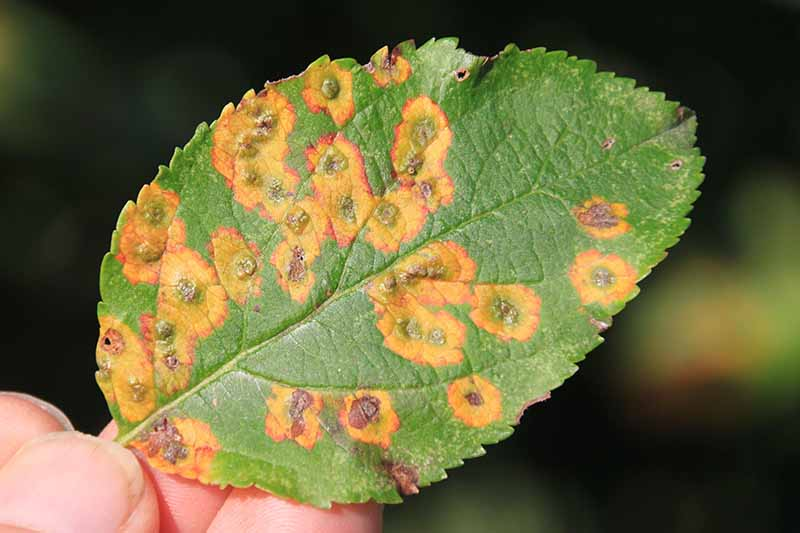
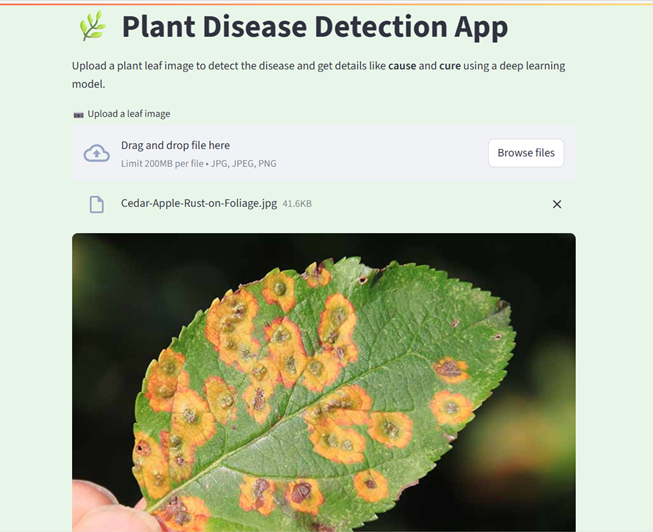
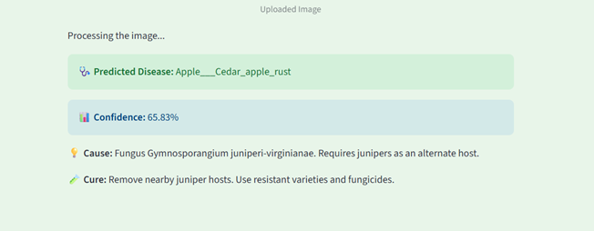
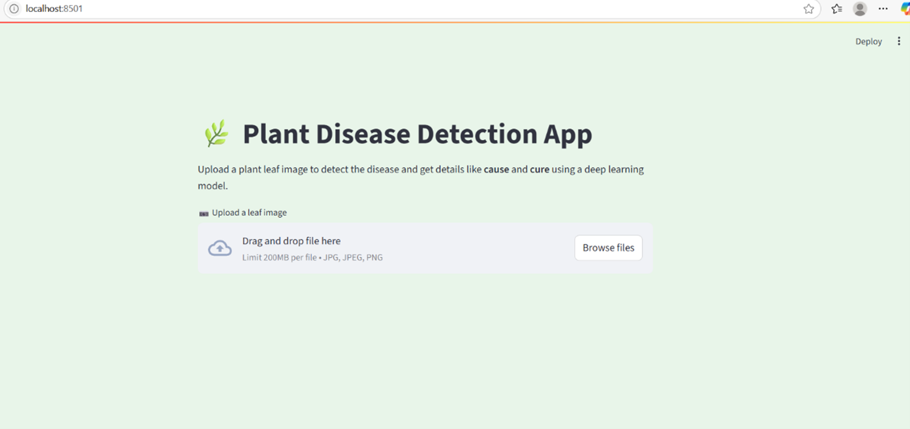

# 🌿 Plant Disease Detection Using Deep Learning

A deep learning–based system that can identify plant leaf diseases from images with **98% accuracy** — and tell you the **cause** and **cure**! 
Built using **EfficientNet**, trained on the **PlantVillage dataset**, and deployed with an interactive **Streamlit app**.

---

## 🚀 Project Overview

This project uses computer vision and deep learning to identify various plant diseases from leaf images. With an intuitive web interface, users can upload an image and instantly receive a diagnosis — including:

-  Disease Name  
-  Confidence Score  
-  Cause of the disease  
-  Suggested Cure  

---

## 🧠 Technologies Used

- **Python**, **TensorFlow**, **Keras** – for model development and training  
- **EfficientNetB4** – for high-accuracy image classification  
- **Google Colab** – for GPU-accelerated training  
- **Streamlit** – for building the interactive web app  
- **NumPy**, **Pandas**, **Matplotlib**, **Seaborn** – for data handling & visualization  
- **Pillow** – for image preprocessing  
- **JSON** – to store metadata about diseases (cause & cure)

---

## 🧪 How to Run the App Locally

1. **Clone the repository**
   ```bash
   git clone https://github.com/SuhaniSharma1309/Plant-disease-detection-model.git
   cd Plant-disease-detection

2. **Install the required packages**

   ```bash
   pip install -r requirements.txt

3.  **Run the Streamlit app**

     ```bash
     streamlit run app.py
4.  **Upload a leaf image through the app interface and get predictions with disease name, confidence, cause, and cure.**


## 🖼️ Streamlit Interface Preview

### 📥 Upload Leaf Image



### 🔍 Model Prediction Output



### 🌿 Full App View


## 👩‍💻 Authors

- **Divyanka Dixit**  
  B.Tech CSE | Amity University Noida  
  📧 divyankadixit1@gmail.com
  
- **Suhani Sharma**  
  B.Tech CSE | Amity University Noida  
  📧 suhanisharma1309@gmail.com  

  
## 📝 License
This project is for academic and research use only.

   **Made with 💚**

